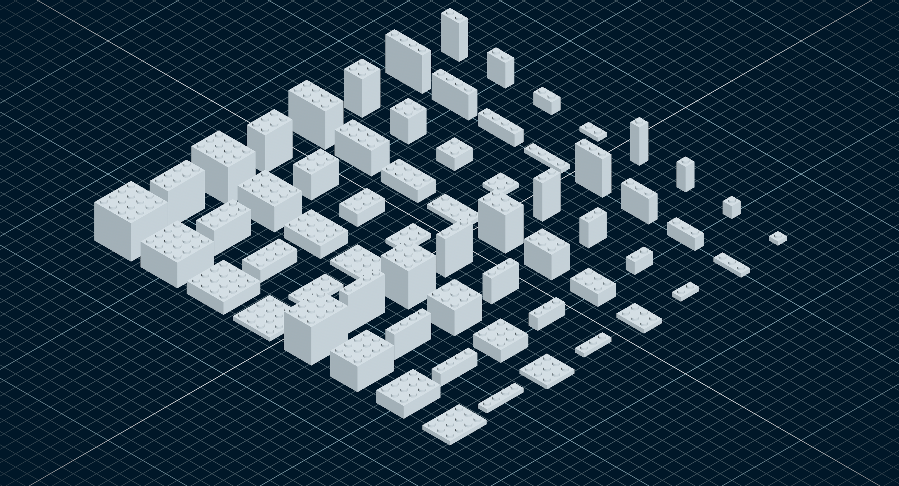

# µcad

[](https://ci.codeberg.org/repos/15446)
[](https://crates.io/crates/microcad)
[](https://deps.rs/repo/codeberg/microcad/microcad)


µcad (pronounced *microcad*) is a description language for modeling parameterizable geometric objects.

Simple basic shapes can be composed to create complex geometries which then can be rendered into STL
or SVG files for 3D printing or CNC milling.

**Note**: This project is in an early stage of development and is not yet feature complete.

Feel free to [contribute](CONTRIBUTE.md) by opening issues or pull requests.

## Content

- [Content](#content)
- [Quick Start](#quick-start)
- [First Example](#first-example)
- [Installation](#installation)
- [Command line usage](#command-line-usage)
- [Using the viewer](#using-the-viewer)
- [Documentation](#documentation)
- [❤️ Support the project](#️-support-the-project)
- [💚 Funded by](#-funded-by)

## Quick Start

*µcad* is programmed in [Rust](https://www.rust-lang.org/) which easily can be
[installed](https://www.rust-lang.org/tools/install) on several operating systems.
You can try it out with an example by using the command line tool `microcad`
which can be installed from [crates.io](https://crates.io/crates/microcad) by using
the following command line:

```sh
cargo install microcad
```

**Note**: Currently µcad has no binary install packages so the only ways to install
it are with [`cargo install`](#installation) or from the source code (see section
[Contribute](CONTRIBUTE.md#contribute-documentation)).

## First Example

The following µcad source code defines a *part* called `CsgCube`, which has a body of a cube with
rounded corners and three cylinders as holes:


```µcad,first_example
use std::math::*;
use std::ops::*;
use std::geo3d::*;

part CsgCube(size: Length) {
    body = Sphere(size / 1.5) & Cube(size);
    holes = Cylinder(size, diameter = size / 1.5).orient([X,Y,Z]);
    body - holes;
}

CsgCube(50mm);
```

## Installation

First, install [Ninja Build](https://github.com/ninja-build/ninja) which is needed to compile
the [manifold geometry library](https://github.com/elalish/manifold).
For example, *Debian* based *Linux* distributions use the following line:

```sh
sudo apt install ninja-build cmake
```

To install the latest release of *µcad* via *cargo*, type:

```sh
cargo install microcad
```

## Command line usage

After installing, you can run a basic example by typing:

```sh
microcad eval ./examples/bricks/brick
```

This will *evaluate* the input file and will output the model tree.
The *evaluate* command will not export the output geometry.

To generate an STL model file use the `export` command with an additional output file name:

```sh
microcad export ./examples/bricks/brick
```

The file [`brick.µcad`](examples/bricks/brick.µcad) generate a file called`brick.stl`
which can be displayed e.g. with [MeshLab](https://www.meshlab.net/).

The resulting STL mesh looks like this:



## Using the viewer

To install the latest release of the µcad viewer via *cargo*, type:

```sh
cargo install microcad-viewer
```

You can run the viewer with a file:

```sh
microcad-viewer ./examples/bricks/brick
```

## Documentation

- [Language reference](http://docs.microcad.xyz/language/book/)
- [Contribute Documentation](CONTRIBUTE.md)

## ❤️ Support the project

If you like this project, you can help us spend more time on it by donating:

<a href="https://opencollective.com/microcad/donate" target="_blank">

</a>

## 💚 Funded by

Thanks to the [Prototype Fund](https://www.prototypefund.de/) and the [Federal Ministry of Research, Technology and Space](https://www.bmbf.de/EN/) for funding this project in 2025.


