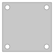

# Example: drill_plate

[](.test/drill_plate.log)

```µcad,drill_plate
// Copyright © 2025 The µcad authors <info@ucad.xyz>
// SPDX-License-Identifier: AGPL-3.0-or-later

use std::geo2d::*;
use std::ops::*;

/// A drill plate with four holes.
#[color = "red"]
sketch DrillPlate(size = 100mm, hole_size = 10mm) {
    l = size/2 - hole_size;
    Rect(size) - Circle(diameter = hole_size).translate(x = [-l,l], y = [-l,l])
}

DrillPlate();

```

**2D Output**
    : 

**3D Output**
    : 
