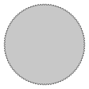

# Example: gears

## Module: gear_2d

[](.test/gears_gear_2d.log)

```µcad,gears_gear_2d
// file: gear_2d
// Copyright © 2025 The µcad authors <info@ucad.xyz>
// SPDX-License-Identifier: AGPL-3.0-or-later

use std::ops::*;
use std::geo2d::*;

InvoluteGearProfile(1.0mm, 100);

```

2D Output
    : 

3D Output
    : 

## Module: gears_3d

[](.test/gears_gears_3d.log)

```µcad,gears_gears_3d
// file: gears_3d
// Copyright © 2025 The µcad authors <info@ucad.xyz>
// SPDX-License-Identifier: AGPL-3.0-or-later

use std::ops::*;
use std::geo2d::*;
use std::math::*;

const TEETH = 20;

angle = 30° * TEETH;

part Gear(teeth: Integer) {
    gear_profile = InvoluteGearProfile(module = 1.0mm, teeth);

    prop pitch_radius = gear_profile.pitch_radius;
    prop outer_radius = gear_profile.outer_radius;

    n_holes = 5;

    bearing_hole = Circle(gear_profile.pitch_radius / 8);
    
    hole_radius = pitch_radius / n_holes;
    holes = Circle(pitch_radius / n_holes).translate(x = outer_radius - hole_radius * 2).rotate([1..n_holes] * 360° / n_holes);

    inner = Circle(pitch_radius - 3mm);

    bearing = (Circle(pitch_radius / 4) - bearing_hole).extrude(8mm) - 
        Circle(gear_profile.module)
            .extrude(pitch_radius / 4)
            .translate(z = -pitch_radius / 4).rotate(x = 90°).translate(z = 5mm);

    bearing | (inner - holes - Circle(pitch_radius / 4)).extrude(2mm) | (gear_profile - inner).extrude(4mm);
}


gear1 = Gear(80);
gear2 = Gear(40);
gear3 = Gear(20);

#[color = std::color::BLUE]
#[export = "gear1.stl"]
gear1.rotate(angle / gear1.teeth);

#[color = std::color::RED]
#[export = "gear2.stl"]
gear2.rotate(-angle / gear2.teeth + 360°/gear2.teeth/2.0).translate(gear2.outer_radius + gear1.pitch_radius, 135°);

#[color = std::color::GREEN]
#[export = "gear3.stl"]
gear3.rotate(-angle / gear3.teeth).translate(gear1.outer_radius + gear3.pitch_radius, 45°);


```

2D Output
    : 

3D Output
    : 

## Module: herringbone_gears

[](.test/gears_herringbone_gears.log)

```µcad,gears_herringbone_gears
// file: herringbone_gears
// Copyright © 2025 The µcad authors <info@ucad.xyz>
// SPDX-License-Identifier: AGPL-3.0-or-later

use std::ops::*;
use std::geo2d::*;
use std::math::*;

part Gear(teeth: Integer)  {
    gear_profile = InvoluteGearProfile(1.5mm, teeth);
    prop outer_radius = gear_profile.outer_radius;
    prop pitch_radius = gear_profile.pitch_radius;
    prop tooth_angle = gear_profile.tooth_angle;
    prop tooth_distance = gear_profile.tooth_distance;
    prop module = gear_profile.module;

    disc = Circle(pitch_radius - module * 400%);
    web = {
        sector = Sector(disc.radius, 360° / 5)
            .buffer(-disc.radius * 15%)
            .buffer(disc.radius * 12%);
        holes = (sector - Circle(module * 1000%))
            .rotate([0..4] * 360° / 5);
        hub = InvoluteGearProfile(2.5mm, 7);
        disc - holes - hub;
    }.extrude(tooth_distance * 300%).center();

    rim = (gear_profile - disc)
        .extrude(tooth_distance * 200%, tooth_angle)
        .mirror(-Z);

    web | rim;
}

gear1 = Gear(90);
gear2 = Gear(60);

gear1.reflect(X);
gear2
    .rotate(gear2.tooth_angle * 50%)
    .translate(gear1.outer_radius + gear2.pitch_radius, [1..3] * 360° / 3);


```

2D Output
    : 

3D Output
    : 

