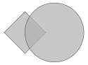

# Example: multi_export

[](.test/multi_export.log)

```µcad,multi_export
// Copyright © 2025 The µcad authors <info@ucad.xyz>
// SPDX-License-Identifier: AGPL-3.0-or-later

use std::ops::*;

#[export = "rect.svg"]
std::geo2d::Rect(42mm)
    .rotate(45°);

#[export = "circle.svg"]  // Will be exported to `circle.svg`
std::geo2d::Circle(r = 42mm)
    .translate(x = 42mm);

```

**2D Output**
    : 

**3D Output**
    : 
