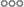

# Creating circles

We now can easily construct a single strut by using `std::geo2d::Circle()` and repeat the lesson we had before,
but our Lego brick needs *three* of them.

The shape of each strut remains the same - they’re simply offset horizontally by `8mm` to left and right.
From the concept we know already, a first solution could be to write the strut three times
and translate them using `std::ops::translate()`.

[](.test/multiple.log)

```µcad,multiple
use std::geo2d::*;
use std::ops::*;

Circle(diameter = 6.51mm) - Circle(diameter = 4.8mm);
(Circle(diameter = 6.51mm) - Circle(diameter = 4.8mm)).translate(x = 8mm);
(Circle(diameter = 6.51mm) - Circle(diameter = 4.8mm)).translate(x = -8mm);
```



The code above produces the expected result. However, the code is quite repetitive.
We could improve it slightly by storing the expression `Circle(d = 6.51mm) - Circle(d = 4.8mm)` in a value, say `strut`.
But even then, we’d still need to write out each `translate(...)` call manually.

And more importantly:
What if we wanted the number of struts to be flexible or generated dynamically?

To solve this in a clean and scalable way, µcad supports *multiplicity*, allowing us to generate repeated geometry with minimal, reusable code.

Let’s explore that next.

## TODO

- Do we need to explain that we now uses `( .. ).translate()` instead of curly brackets?
