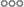

# Multiplicity

To avoid having to call `translate` multiple times, µcad provides a powerful feature called *multiplicity*.
Instead of applying `translate()` separately for each position, you can pass it an [array of values](../types/arrays.md).
An array of values is expressed with `[]` brackets.
µcad then will automatically apply the operation once for each value in the array.

This allows us to shorten the previous example significantly:

[](.test/multiplicity.log)

```µcad,multiplicity
use std::geo2d::*;
use std::ops::*;

(Circle(diameter = 6.51mm) - Circle(diameter = 4.8mm))
    .translate(x = [-8mm, 0mm, 8mm]);
```



With just a single line of code, we've created three struts -  each correctly positioned!
This approach is not only more concise, but also easier to maintain and scale,
especially if you later want to add more positions dynamically.

But we still have to write `8mm` twice, but we can change this be multiplying the array with that value:

[](.test/array_mul.log)

```µcad,array_mul
use std::geo2d::*;
use std::ops::*;

(Circle(diameter = 6.51mm) - Circle(diameter = 4.8mm))
    .translate(x = [-1, 0, 1] * 8mm);
```


