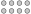
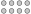

# Sketch caps & knobs

With the knowledge we have gained in the previous chapter,
the remaining sections of the brick (`Cap` and `Knobs`) can be constructed swiftly.

## Cap

The `Cap` is nothing more than a rectangle.
We do not have to define a specific `sketch Cap`, instead we can use an *alias*:

[](.test/cap.log)

```µcad,cap
// alias Rect as Cap
use std::geo2d::Rect as Cap;

Cap(width = 31.8mm, height = 15.8mm);
```


`std::geo2d::Rect` will now also be known as `Cap`.

## Knobs

The knobs of the brick are simple circles with a diameter of `4.8mm`.
We can easily construct a grid with circles via multiplicity:

[](.test/knobs_multiplicity.log)

```µcad,knobs_multiplicity
std::geo2d::Circle(d = 4.8mm, c = (
        x = ([-1..2] - 0.5) * 8mm, 
        y = ([0..1] - 0.5) * 8mm)
    );
```



Because ranges can only deal with integers, calculating `x` and `y` is a bit tricky here,
because `x` is `[-1..2]` (which is `[-1, 0, 1, 2]`) and `y` is `[0..1]`, we now have no
element in the middle anymore.
So we have to subtract `0.5` from all the array values before multiplying with `8mm` to get a centered result.

To avoid this complication we can use the operation `center()`.
By default, if we do not pass any arguments to operation, it will center the object to origin.

[](.test/knobs_center.log)

```µcad,knobs_center
std::geo2d::Circle(d = 4.8mm, c = (
        x = [0..3] * 8mm, 
        y = [0..1] * 8mm)
    ).std::ops::center();
```



The code looks clearer now.

### Tuples

Notice that we have called the `std::geo2d::Circle` with an additional argument `c`.
`c` is given as a *tuple* `(x = ..., y = ...)`.
A [tuple](../types/tuples.md) is a collection of (mostly named) values.

The parameter `c` of a circle is supposed to be a tuple of type `(x: Length, y: Length)`.
By passing an array of `Length` to the tuple, we are generating a *multiplicity*, which eventually creates `2*4` circles.

Let's create a sketch for the knobs:

[](.test/knobs.log)

```µcad,knobs
sketch Knobs(diameter = 4.8mm) {
    std::geo2d::Circle(d = 4.8mm, c = (x = [0..3] * 8mm, y = [0..1] * 8mm))
        .std::ops::center();
}

Knobs();
```


We now have all the sketches we need!
Let's move on and bring them together...
