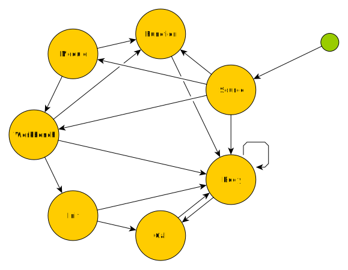

# Basic Concepts

- [µcad Rules](#µcad-rules)
- [The Build Process](#the-build-process)
  - [Parsing Phase](#parsing-phase)
  - [Resolving Phase](#resolving-phase)
  - [Evaluation Phase](#evaluation-phase)
  - [Export Phase](#export-phase)
  - [Viewing](#viewing)
- [Elements](#elements)
- [Coding Conventions](#coding-conventions)
  - [Naming](#naming)
- [Statement Usage](#statement-usage)

## µcad Rules

To stay on course while continuing development of µcad we have expressed some rules that may guide us:

1. µcad is a declarative markup language. This means µcad avoids imperative control flow statements: for, while, goto.
2. Complex generic functionalities (like generating objects or mathematical functionalities)
   shall be put into *builtin libraries* instead of implementing them within µcad itself.
3. The *standard library* shall implement a convenient interface to the builtin library.
4. µcad enforces a strict *modular concept* to improve code quality.
5. Explicit naming of *arguments* (within in *calls*) is encouraged.
6. Explicit writing of *units* at *values* is forced.

## The Build Process

The *µcad* interpreter runs programs which generate geometry files.
The processing of *µcad* source code files into output files can be divided into separate phases:

### Parsing Phase

In the parsing phase one source file is read into a *syntax tree* by using the [*µcad* grammar](../lang/grammar.pest).
Any errors which occur within the parsing phase are related to file access or syntax.

### Resolving Phase

In the resolving phase, the following steps are done:

1. the search paths will be recursively scanned for any external µcad files
2. all symbols (e,g, parts, functions, constants and modules) in the source file will be put into a symbol tree

At the end all dependent files are loaded and syntax definitions are placed in the symbol tree and everything can be found by it's qualified name.

### Evaluation Phase

In the evaluation phase, the *syntax tree*  will be processed into the *object node tree*
which is a structured representation of the geometry.
While this phase the following things will be done:

- expressions will be calculated
- functions will be called
- parts will generate *object nodes*
- user messages will be output on console

Any errors which occur within the evaluation phase are related to semantic issues.

### Export Phase

In the export phase the *object nodes* will be taken to generate 2D or 3D output files
(e.g. *SVG* or *STL*).
While this phase the following things will be done:

- geometric operations will be processed
- geometries will be rendered
- the output files will be written

Any errors which occur within the export phase are related to geometrical processing or file access.

### Viewing

**Note**: Currently *µcad* does not have any available viewer.

The viewing phase generates images which can be shown to visualize *object nodes* (e.g. in an IDE).
Any errors which occur here are related to geometrical processing.

## Elements

| Method     | Input             | Output            | Statement  | Declaration           |
| ---------- | ----------------- | ----------------- | ---------- | --------------------- |
| Assignment | *value*           | *value*           | `v = ..;`  | -                     |
| Function   | *values*          | *value*           | `f(..);`   | `fn f(..) { .. }`     |
| Sketch     | *values*          | *2D object*       | `s(..);`   | `sketch S(..) { .. }` |
| Part       | *values*          | *3D object*       | `p(..);`   | `part P(..) { .. }`   |
| Operation  | *2D or 3D object* | *2D or 3D object* | `o(..) p;` | `op o(..) {..}`       |
| Measure    | *2D or 3D object* | *value*           | `a.m();`   | *builtin only*        |

## Coding Conventions

### Naming

| Element   | Example              | Format                |
| --------- | -------------------- | --------------------- |
| type      | `MyType`             | pascal case           |
| const     | `const MY_CONST = 1` | upper case snake case |
| module    | `mod my_lib`         | snake case            |
| function  | `fn my_func`         | snake case            |
| sketch    | `sketch MyBench`     | pascal case           |
| part      | `part MyBench`       | pascal case           |
| operation | `op my_bench`        | snake case            |
| variables | `my_var = 1`         | snake case            |

## Statement Usage

| Stack frame | workbench | module | function | init  |  use  | pub use | return |  if   | marker |    assignment    | expression |
| :---------- | :-------: | :----: | :------: | :---: | :---: | :-----: | :----: | :---: | :----: | :--------------: | :--------: |
| Source      |    yes    |  yes   |   yes    |   -   |  yes  |   yes   |   -    |  yes  |   -    |    const, var    |    yes     |
| Module      |    yes    |  yes   |   yes    |   -   |  yes  |   yes   |   -    |   -   |   -    |    const, var    |     -      |
| Pre-Init    |     -     |   -    |    -     |  yes  |  yes  |    -    |   -    |   -   |   -    |      const       |     -      |
| Init        |     -     |   -    |    -     |   -   |  yes  |    -    |   -    |   -   |   -    |       var        |     -      |
| Workbench   |     -     |   -    |    -     |  yes  |  yes  |    -    |   -    |  yes  |  yes   | const, var, prop |    yes     |
| Body        |     -     |   -    |    -     |   -   |  yes  |    -    |   -    |  yes  | ?yes?  |    const, var    |    yes     |
| Function    |     -     |   -    |    -     |   -   |  yes  |    -    |  yes   |  yes  |   -    |       var        |    yes     |
| Call        |     -     |   -    |    -     |   -   |   -   |    -    |   -    |   -   |   -    |        -         |     -      |

[See tests](tests/statement_usage.md)

## Stack Frames

