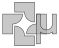

# µcad logo

[](.test/logo.log)

```µcad,logo
mod microcad {
    use std::geo2d::*;
    use std::ops::*;

    sketch HalfCircle(radius: Length) {
        Circle(radius) - Rect(size = radius * 2).translate(y = radius );
    }

    sketch IconElement( radius: Length ) {
        c = HalfCircle(radius);
        r = Rect(width = radius, height = radius * 2);
        c.translate(y = radius) | r.translate(x = -radius/2 );
    }

    pub sketch Icon( radius: Length ) {
        prop gap = radius / 5;
        IconElement(radius)
            .translate(x = -radius-gap, y = 0mm, z = 0mm)
            .rotate(z = [0°, -90°, -180°, -270°]); 
    }

    pub sketch Micro( radius: Length, thickness: Length ) {
        u = HalfCircle(radius) - HalfCircle(radius-thickness);
        r_l = Rect(width = thickness, height = radius * 3);
        r_r = Rect(width = thickness, height = radius * 2);
        u.translate(y = radius/2)
            | r_l.translate(x = -(radius-thickness/2) ) 
            | r_r.translate(x = radius-thickness/2, y=radius/2 );
    }
}

use std::ops::*;

radius = 1cm;
thickness = 4mm;
icon = microcad::Icon(radius);
icon;

microcad::Micro(radius, thickness).translate(x=radius*2+icon.gap, y=-radius/2);

```


